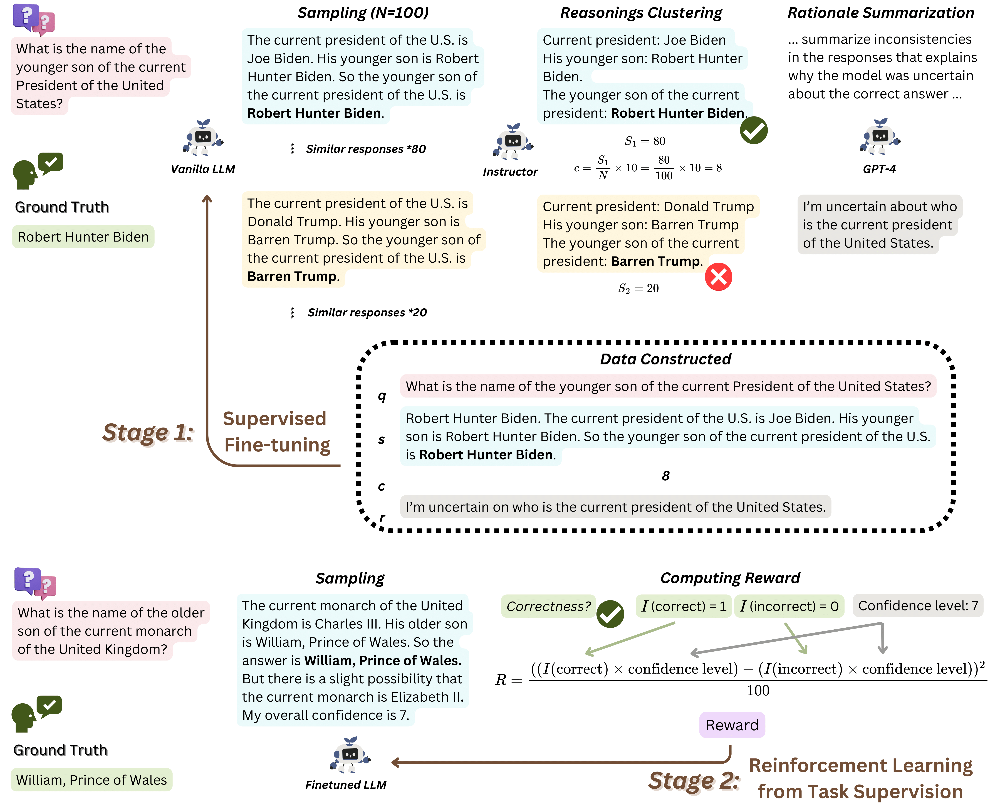

#  [SaySelf: Teaching LLMs to Express Confidence with Self-Reflective Rationales](https://arxiv.org/abs/2405.20974) [EMNLP 2024]


## Overview
We present the advanced SaySelf, a training framework that teaches LLMs to express more accurate fine-grained confidence estimates. In addition, beyond the confidence scores, SaySelf initiates the process of directing LLMs to produce self-reflective rationales that clearly identify gaps in their parametric knowledge and explain their uncertainty. 


The overview of SaySelf:



## Requirements
The required Python packages for running this repo are listed in [requirements.txt](./requirements.txt). You can create a new conda/venv environment, then run
```shell
pip install -r requirements.txt
```
to install them.

You may need to set environment variables `OPENAI_API_KEY` and `OPENAI_API_VERSION` to run some scripts.

## Training
Code for stage-1 training (SFT) is located in [finetune.py](./training/finetune.py). [stage_1_finetune.sh](./training/stage_1_finetune.sh) provides an easy-to-run script to run Stage-1 training. You can change the parameters at the beginning of the script to control the parameters of the training and do SFT on different datasets.

> [!NOTE]  
> [./datasets/stage_1/](./datasets/stage_1/) consists of multiple datasets for Stage 1 training: \
> [sft_reason_conf.jsonl](./datasets/stage_1/sft_reason_conf.jsonl) is for standard SaySelf training; \
> [sft_without_reason_conf.jsonl](./datasets/stage_1/sft_without_reason_conf.jsonl) is a baseline for SaySelf without self-reflection and confidence; \
> [sft_without_reason_with_conf.jsonl](./datasets/stage_1/sft_without_reason_with_conf.jsonl) is a baseline for SaySelf with confidence, but without self-reflection; \
> [sft_reason_rtuning.jsonl](./datasets/stage_1/sft_reason_rtuning.jsonl) is a baseline for R-Tuning;
> [sft_reason_calimath.jsonl](./datasets/stage_1/sft_reason_calimath.jsonl) is a baseline for GCE, as in the article.

Code for stage-2 training is located in [rlhf_train.py](./training/rlhf_train.py). You can use [stage_2_finetune.sh](./training/stage_2_finetune.sh) to run it as well. To reproduce the ablation test for the reward function, you will need to manually edit the function `calculate_reward` [here](./utils/utils.py).

## Evaluation
Evaluation results in Tables 1, 2, and 3 are generated with script [evaluate.py](./evaluation/evaluate.py). For PEFT models, run it with [evaluate_dataset_peft_model.sh](./evaluation/evaluate_dataset_peft_model.sh); For other models, run it with [evaluate_dataset_model.sh](./evaluation/evaluate_dataset_model.sh).

Faithfulness evaluation results in Table 4 are generated in two steps:
1. Generate self-reflections in batch with [generate_reasons_for_evaluation.py](./evaluation/generate_reasons_for_evaluation.py)
2. After the self-reflections are generated, evaluate them with [evaluate_reasons.py](./evaluation/evaluate.py). 

> [!CAUTION]
> Due to the limitations of VLLM, before generating the self-reflections with PEFT models (which is the format that our code saves in default), please merge it with the original large model using [this function](https://huggingface.co/docs/peft/v0.6.2/en/package_reference/tuners#peft.LoraModel.merge_and_unload). 

## Citation
If you use or extend our work, please consider citing our paper. Thank you for your support! 🥰
```
@article{xu2024sayself,
      title={SaySelf: Teaching LLMs to Express Confidence with Self-Reflective Rationales}, 
      author={Xu, Tianyang and Wu, Shujin and Diao, Shizhe and Liu, Xiaoze and Wang, Xingyao and Chen, Yangyi and Gao, Jing},
      journal={arXiv preprint arXiv:2405.20974},
      year={2024}
}
```

